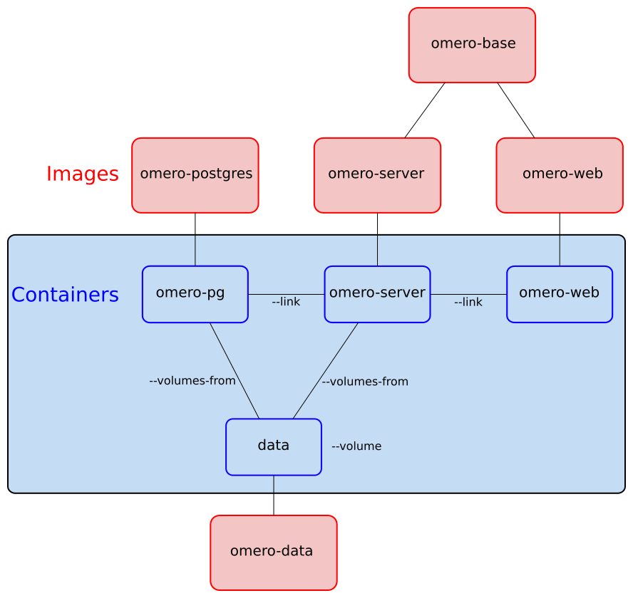

# docker-omero

Set of Dockerfile to setup an OMERO server. This project aims to be used in production. For now `docker-omero` does not use [Docker Hub](https://hub.docker.com). It will in the future when the project will be more stable.

## How to setup OMERO.server

Build images:

```
make build
```

## How to start OMERO.server:

```
make initdata
make start
```

You can now connect to OMERO with the [OMERO Insight client](http://downloads.openmicroscopy.org/latest/omero5). Or you can access via OMERO.web client at http://localhost:80. Default admin credentials are root and password. Don't forget to change the password !

If you want to stop the OMERO server, you can do:

```
make stop
```

To start the server at the same state than you stoped it:

```
make start
```

To start a shell in the data container:

```
make datash
```

If you want to definitively remove data container (all data inside will be lost):

```
docker rm data
```

You will have to re init data container with `make initdata`.

## Log

`var` directory (which contains logs) is symlinked to `/data/omero_var`.

```
make datash
ls omero_var/log/
Blitz-0.log        FileServer.log     MonitorServer.log  Processor-0.log    master.err
DropBox.log        Indexer-0.log      PixelData-0.log    Tables-0.log       master.out
```

Note that you can also access to the omero container with `make omerosh`.

## Backup and restore

If you want to make a backup you can run:

```
sh backup.sh /some_directory
```

Next you can restore a backup and start a new instance of OMERO.server with:

```
sh restore.sh /some_directory/backup_file.tar.bz2
make start
```

## Fig support

`docker-omero` can also use [Fig](http://www.fig.sh/index.html) to setup and start containers.

```
fig build
fig up
```

Use `fig up -d` if you want to run in background.

For now, using Fig does not allow backup/restore scripts and commands like `make datash`.

Things needed to have complete support of this project:

- Variable expansion inside fig.yml (with default value) : https://github.com/docker/fig/issues/495
- `fig up` should only run a subset of containers : https://github.com/docker/fig/issues/697
- Explicit container names : https://github.com/docker/fig/issues/652
- Support every `docker run` options : https://github.com/docker/fig/issues/754 and https://github.com/docker/fig/issues/363
- Support exec command : https://github.com/docker/fig/issues/593

## About the images

**omero-base**: based on ubuntu 14.04, it contains omego and install OMERO.server.

**omero-data**: volume container based on busybox. `/data` is defined as a volume.

**omero-postgres**: based on postgres:9.3. It contains only few modifications from the original image.

**omero-server**: based on omero-base, it runs OMERO.server.

**omero-web**: based on omero-base, it runs OMERO.web.

See this schema for more details about how things are connected:



## TODO

- investigate fig
- add processor server

## Authors

Hadrien Mary <hadrien.mary@gmail.com>

## License

MIT License. See [LICENSE](LICENSE).
